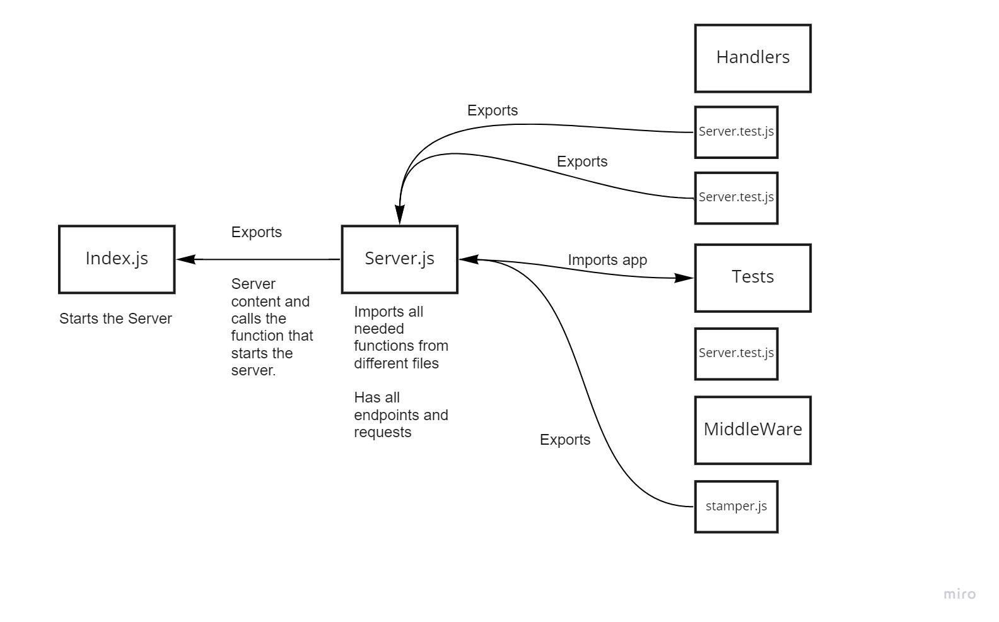

# server-deployment-practice

## LAB - 01
### Deployment Test
Author: Sana Ishaqat

[tests report (actions)](https://github.com/SanaIshaqat/server-deployment-practice/actions)

[back-end (heroku)](https://sanaishaqat-server-deploy-prod.herokuapp.com/status)

[PR Link](https://github.com/SanaIshaqat/server-deployment-practice/pull/4)

### Setup
.env requirements
PORT - Port Number

### Running the app
npm run dev
Endpoint: /status
Returns Object
{
  "status": "running",
  "port": 3030,
  "domain": "sanaishaqat-server-deploy-prod.herokuapp.com"
}

### Tests
Unit Tests: npm run test
Run Server: npm run dev "Runs Index.js"

UML
